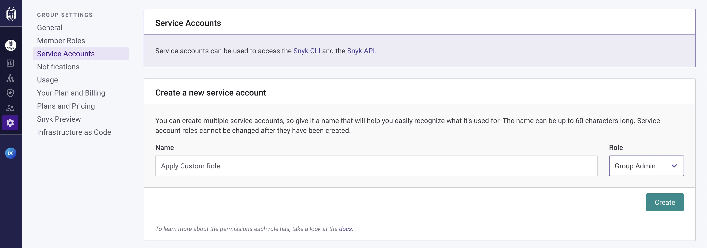
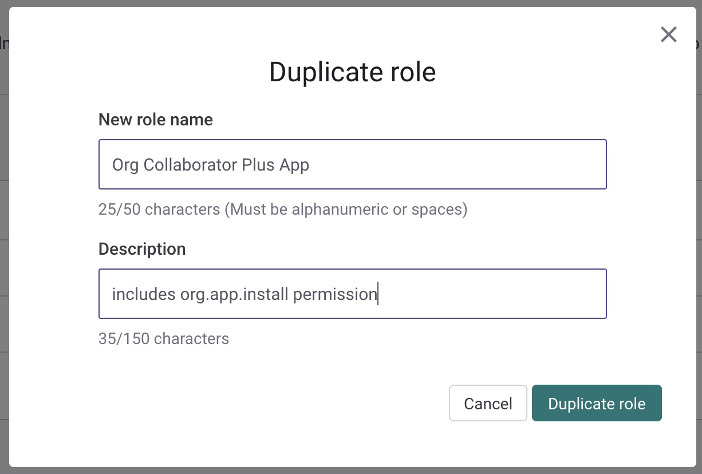
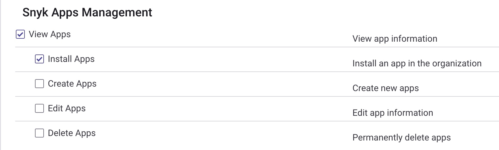

# Apply Custom Roles Script

In order to participate in the Snyk Bug Bash a user needs to have the `org.app.install` permission (or be a `Group` or `Org` admin). This permission is _NOT_ in the default `Org Collaborator` role.

A Snyk custom role needs to be created that includes the `org.app.install` permission and then each participant needs to be assigned that custom role.

This can be very tedious to do manually. The purpose of this script is to automate assigning Bug Bash participants the custom role in each Org within the Group they belong to.

Follow the steps below to run this script.

## Setup

There are four bits of setup you need to do before running the script:

- Note Group Id
- Create an API token
- Create a Custom Role that includes the `org.app.install` permission
- Create a text file with email addresses to apply the Custom Role to

### Note Group Id

1. In your Snyk Group, navigate to `Settings > General`.
2. Click `Copy` to the right of the `Group ID` section.

The Group Id is used when running the script below.

### Create an API Token

1. In your Snyk Group, navigate to `Settings > Service Accounts`.
2. Enter a `Name` and select `Group Admin` for the role. Click `Create`.

**NOTE**: You'll need to click `Copy` to save the API token as it will not be shown again. This will be used with the script below.



### Create a Custom Role

1. In your Snyk Group, navigate to `Settings > Member Roles`.
2. Click the `copy` icon to the right of the built-in `Org Collaborator` role.
3. Fill in `New role name` and `Description` fields.
4. Click `Duplicate Role`.



5. Scroll down to the `Snyk Apps Management` section
6. Select `Install Apps`



7. Scroll to the bottom and click `Update Role Permissions`

**NOTE**: save the `ID` of the new role from the top-right for use later with the script.

### Create an email text file

Create a text file that has the email addresses you want to have the new custom role applied to. The format of the file should be one email address per line, such as:

```
micah@afitnerd.com
mps@MPowerIT.com
```

**NOTE**: The emails are processed in a case-insensitive way.

## Apply the Custom Role

### Requirements

You'll need to have [Node.js](https://nodejs.org/) installed.

In the folder of this repo, run the following:

```
npm install
```

This installs a few dependencies for the script.

### Run the Script

There are four required switches for the script:

- `-t` - the API Token you created above
- `-g` - the Group Id you noted above
- `-r` - the Custom Role Id you noted above
- `-f` - the path to the email file you created above

For example:

```
node apply_custom_roles.js \
-t <token> \
-g <group id> \
-r <role id> \
-f /tmp/emails.txt
```

The script does the following:

- read the file of email addresses
- fetch the complete list of `Org Ids` in the `Group`.
- for each `Org`, fetch the list of `Members`.
- for each `Member`, see if its `Email` is included in the list of emails. If so, apply the `Custom Role`

The output will look something like this:

```
Read in 3 email addresses
read 100 orgs on page 1 for group a75b3507-fbce-476d-ba55-78906ecedb79
read 100 orgs on page 2 for group a75b3507-fbce-476d-ba55-78906ecedb79
read 100 orgs on page 3 for group a75b3507-fbce-476d-ba55-78906ecedb79
read 88 orgs on page 4 for group a75b3507-fbce-476d-ba55-78906ecedb79
Working on org: ato22-00c9201513b658f6450932267a0d1f54
	applied role for: mps@MPowerIT.com in org: ato22-00c9201513b658f6450932267a0d1f54
Working on org: ato22-06d673009045da946f402317a32e696e
Working on org: ato22-096b2b76e11a3d556e82b3613aed8b2a
Working on org: ato22-0e7ee2279f08b173dc3d50de7de0b4dd
Working on org: ato22-1032d95a964d2ee85b9b7631d5f56f9b
...
```
